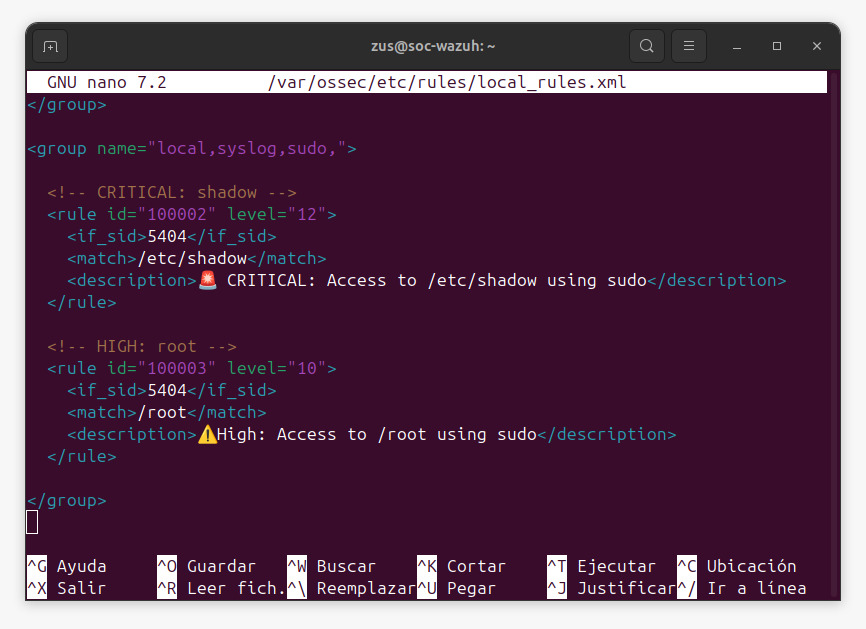
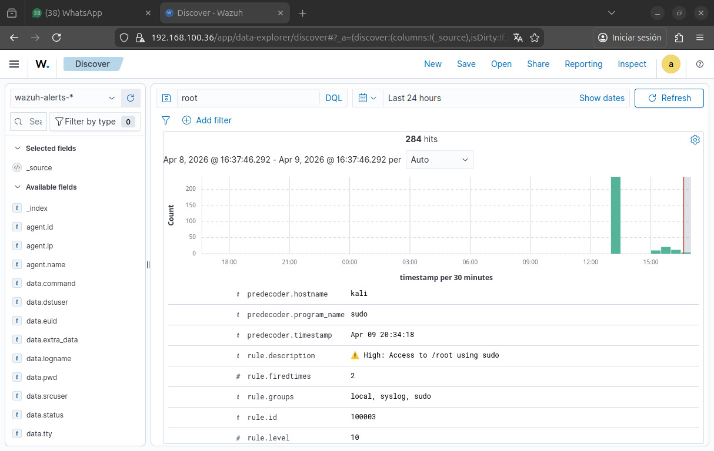
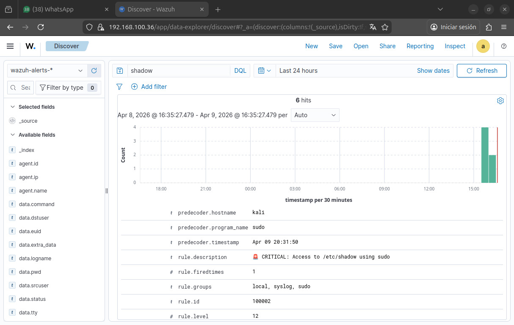

# 🚨 Custom Rules in Wazuh

## 📌 Descripción

Se crearon reglas personalizadas en Wazuh para mejorar la detección de actividades críticas relacionadas con el uso de privilegios elevados (`sudo`).

---

## 🎯 Objetivo

Incrementar la visibilidad sobre accesos a recursos sensibles como:

- `/etc/shadow`
- `/root`

---

## ⚙️ Implementación

Las reglas fueron añadidas en:

/var/ossec/etc/rules/local_rules.xml


---

## 🛠️ Reglas creadas

### 🔴 Acceso a /etc/shadow (Critical)

```xml
<rule id="100002" level="12">
  <if_sid>5404</if_sid>
  <match>/etc/shadow</match>
  <description>CRITICAL: Access to /etc/shadow using sudo</description>
</rule>
```
🟠 Acceso a /root (High)

<rule id="100003" level="10">
  <if_sid>5404</if_sid>
  <match>/root</match>
  <description>High: Access to /root using sudo</description>
</rule>

💣 Simulación

Se ejecutaron comandos en el endpoint:

sudo cat /etc/shadow
sudo ls /root

📊 Resultado en Wazuh

Alertas personalizadas generadas

Incremento de severidad

Mejora en la visibilidad de eventos críticos

🔍 Ejemplo de evento

rule.level: 12
data.command: /usr/bin/cat /etc/shadow

🧠 Análisis SOC

La creación de reglas personalizadas permite:

Adaptar el SIEM al entorno

Priorizar eventos críticos

Reducir ruido y falsos positivos

🚨 Impacto

Detección temprana de actividad maliciosa

Mejora en la respuesta ante incidentes

---

## 📸 Evidencia

### Reglas configuradas



### Antes (detección por defecto)



### Después (regla personalizada)


