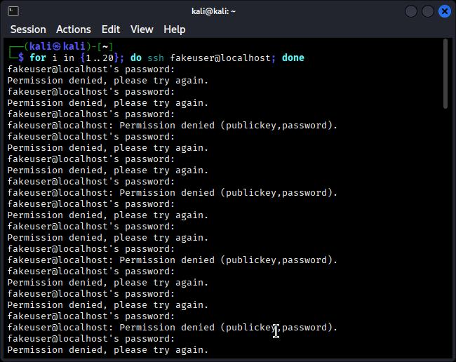
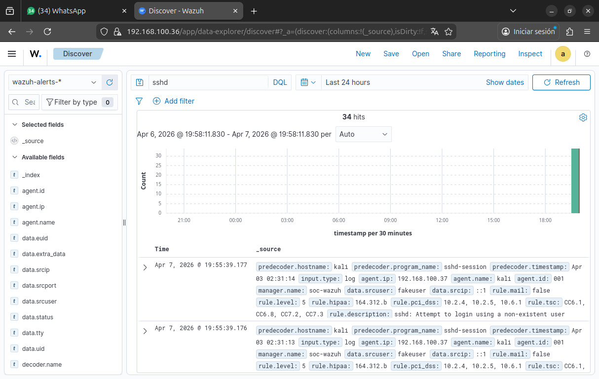

# 🔓 SSH Brute Force Detection

## 📌 Descripción

Se simuló un ataque de fuerza bruta contra el servicio SSH en un entorno controlado utilizando Kali Linux como endpoint monitoreado por Wazuh.

---

## ⚙️ Configuración

- Endpoint: Kali Linux (agente Wazuh)
- SIEM: Wazuh Manager
- Logs: journald (sshd)

---

## 💣 Simulación del ataque

Se ejecutaron múltiples intentos fallidos de autenticación SSH:

```bash
for i in {1..20}; do ssh fakeuser@localhost; done
```

📊 Resultado en Wazuh

El sistema detectó múltiples eventos de autenticación fallida:

"Failed password"
Usuario inválido
Múltiples intentos en corto tiempo

🔍 Ejemplo de log
Failed password for invalid user fakeuser from ::1 port 54346 ssh2
🧠 Análisis SOC

Este comportamiento indica un posible ataque de fuerza bruta, donde un atacante intenta múltiples combinaciones de credenciales para obtener acceso.

🚨 Impacto
Riesgo de acceso no autorizado
Compromiso del sistema


🛡️ Recomendaciones
Implementar fail2ban
Limitar intentos de login
Usar autenticación por clave SSH


## 📸 Evidencia

### Ataque



### Detección en Wazuh




